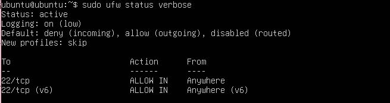

# 02 - Hardening básico del servidor Ubuntu

**Fecha:** 2026-09-13
**Autor:** [Tu nombre]
**Categoría:** Hardening

---

## 1. Objetivo

Reducir la superficie de ataque del servidor Ubuntu recién instalado, aplicando
medidas básicas de endurecimiento: autenticación SSH robusta y firewall con
acceso mínimo necesario, siguiendo el principio de menor privilegio.

## 2. Contexto / Escenario

Un servidor recién instalado, expuesto en red con configuración por defecto,
es un objetivo fácil para ataques automatizados de fuerza bruta contra SSH y
para el descubrimiento de servicios innecesarios expuestos. Antes de usar este
servidor como "objetivo" en ejercicios de detección, se aplicó un hardening
básico equivalente al que se haría en un servidor real recién provisionado.

## 3. Entorno utilizado

- **Servidor:** Ubuntu Server 24.04 LTS (`10.0.2.9`)
- **Cliente de administración:** Kali Linux (`10.0.2.3`), vía SSH
- **Herramientas:** OpenSSH, UFW (Uncomplicated Firewall)

## 4. Procedimiento

### 4.1 Autenticación SSH por clave pública

Generación del par de claves en la máquina cliente (Kali):

```bash
ssh-keygen -t ed25519 -C "kali-lab"
```

Copia de la clave pública al servidor:

```bash
ssh-copy-id ubuntu@10.0.2.9
```

Verificación de acceso sin contraseña:

```bash
ssh ubuntu@10.0.2.9
```

### 4.2 Deshabilitar login root y autenticación por contraseña

Edición del archivo de configuración de SSH en el servidor:

```bash
sudo nano /etc/ssh/sshd_config
```

Cambios aplicados:

```
PermitRootLogin no
PasswordAuthentication no
```

Reinicio del servicio para aplicar los cambios:

```bash
sudo systemctl restart ssh
```

Verificación de la configuración aplicada:

```bash
$ grep -E "^PermitRootLogin|^PasswordAuthentication" /etc/ssh/sshd_config
PermitRootLogin no
PasswordAuthentication no
```

**Verificación crítica de seguridad:** antes de cerrar la sesión SSH activa,
se abrió una segunda sesión desde Kali para confirmar que el acceso seguía
funcionando correctamente con la nueva configuración, evitando quedar
bloqueado fuera del servidor.

### 4.3 Configuración del firewall (UFW)

Permitir tráfico SSH **antes** de activar el firewall (paso crítico para no
perder el acceso remoto):

```bash
sudo ufw allow ssh
```

Activación del firewall:

```bash
sudo ufw enable
```

Verificación del estado final:

```bash
$ sudo ufw status verbose
Status: active
Logging: on (low)
Default: deny (incoming), allow (outgoing), disabled (routed)
New profiles: skip

To                         Action      From
--                         ------      ----
22/tcp                     ALLOW IN    Anywhere
22/tcp (v6)                ALLOW IN    Anywhere (v6)
```


## 5. Hallazgos / Resultados

- El servidor ahora rechaza cualquier intento de login por contraseña,
  eliminando la superficie de ataque más común (fuerza bruta / diccionario
  contra SSH).
- El login directo como root vía SSH está deshabilitado; solo es posible
  administrar el sistema mediante el usuario configurado con `sudo`.
- El firewall UFW está activo con política **deny por defecto** en tráfico
  entrante, permitiendo únicamente el puerto 22/tcp necesario para
  administración remota. Todo el tráfico saliente permanece permitido.

## 6. Análisis

Estas tres medidas atacan los vectores de compromiso inicial más comunes en
servidores Linux expuestos:

- La autenticación por clave elimina el riesgo de credenciales débiles o
  reutilizadas, y hace inviables los ataques de fuerza bruta clásicos.
- Deshabilitar `PermitRootLogin` obliga a cualquier atacante (o administrador)
  a comprometer primero un usuario normal y luego escalar privilegios,
  agregando una capa adicional de dificultad y visibilidad (los intentos de
  `sudo` quedan registrados en logs, a diferencia de un login root directo).
- Un firewall con política *deny by default* reduce la superficie de ataque
  a únicamente los servicios explícitamente necesarios, en este caso solo SSH.

## 7. Remediación / Contención

No aplica (práctica preventiva, no de respuesta a un incidente ya ocurrido).

## 8. Lecciones aprendidas

- El orden de las operaciones es crítico en hardening remoto: siempre validar
  el nuevo método de acceso (clave SSH) **antes** de deshabilitar el anterior
  (contraseña), y siempre permitir el puerto de administración en el firewall
  **antes** de activarlo. Invertir este orden puede dejar el servidor
  inaccesible remotamente.
- Mantener una sesión SSH activa como "red de seguridad" mientras se aplican
  cambios de configuración de acceso es una práctica estándar en entornos
  reales, ya que permite revertir cambios sin necesidad de acceso físico o de
  consola al equipo.
- Verificar los cambios con comandos explícitos (`grep`, `ufw status verbose`)
  en lugar de asumir que un archivo editado quedó correcto, evita errores de
  configuración silenciosos.

## 9. Referencias

- [Ubuntu Server Guide - OpenSSH](https://ubuntu.com/server/docs/service-openssh)
- [UFW - Uncomplicated Firewall (Ubuntu docs)](https://ubuntu.com/server/docs/security-firewall)
